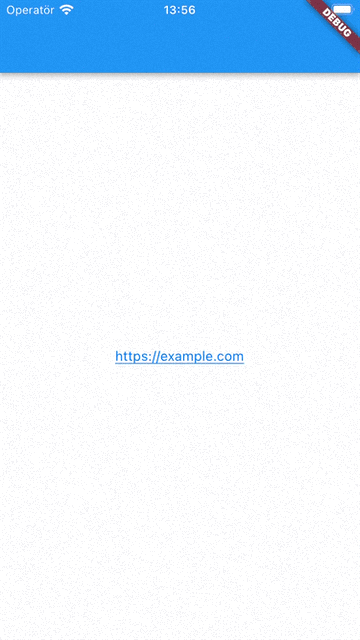

# External Link Account Modal

An easy-to-use widget that complies with Apple's External Link Account design requirements for reader apps.



## About the library

> Reader apps are apps that provide one or more of the following digital content types — magazines, newspapers, books, audio, music, or video — as the primary functionality of the app. With reader apps, people can sign in to their account created outside the app, letting them view and enjoy previously purchased media content or content subscriptions on their Apple device.
> 
> https://developer.apple.com/support/reader-apps/

The library is meant for reader apps that has [applied for and been approved the External Link Account Entitlement](https://developer.apple.com/contact/request/external-link-account/).

According the the [design specifications](https://developer.apple.com/support/downloads/Reader_App_Modal_Specifications.zip), a modal sheet must be displayed before leavning the app. This library aims to simplify the process by providing a ready-to-use Flutter widget. For iOS 16.0 or newer, the native API is called instead of showing the Flutter widget.

## Installation

Add `external_link_account_modal: ^[latest_version]` to your `pubspec.yaml` file.

Import the library in your class: 
```dart
import 'package:external_link_account_modal/external_link_account_modal.dart';
```

If you use it in an app that also targets Android, add the line: `compileSdkVersion 33` to the `build.gradle` file.

## Usage

*Note: This only covers the usage of the actual widget. For more information about setting up your app after receiving the entitlement, go to https://developer.apple.com/support/reader-apps/*

Use `ExternalLinkAccountText` to create a basic link (blue and underlined according to the design specifications). The link opens a modal sheet containg the required information before actually opening the link in an external app.

Example:
```
ExternalLinkAccountText(
    url: 'https://example.com',
    developerName: 'Example Developer',
), 
```

Note that this library only targets iOS, so you should check if this is the current platform before using the widget. For instance:
```
Platform.isIOS ? ExternalLinkAccountText(
    url: 'https://example.com',
    developerName: 'Example Developer',
) : Text('Use a different widget on other platforms')
```

## iOS 16.0, External Link Account API
Starting with iOS 16.0 Apple released the External Link Account API that handles the modal sheet automatically. The URL is instead fetched from your `Info.plist` file and the developer name from the App Store Metadata. **Before release the Developer Name can therefore say 'None'.**

If your app runs on iOS 16 and/or iPadOS 16 or later, it must use the External Link Account API. If it runs on iOS 15 and/or iPadOS 15 or earlier, it must display a modal sheet following the design specifications on the support page. This library aims to handle both cases.

## How it works
The library calls `canMakePayments` before opening the modal. If it fails, the modal is never opened. If you want to perform an action when that happens (such as showing a warning), you can use the `onCanMakePaymentsFailed` variable.

The modal changes appearance based on the current theme (light or dark) according to the design requirements and uses the current device locale (unless provided in the optional `locale` variable) with the default string from Apple. If the locale is not found, English will be used. After the user clicks "Continue", the URL is launched in an external app (the browser) since a webview would not be approved by Apple.

Setting the locale manually is only applicable for iOS <16.0.

Available locale strings:
* en
* ar
* pt_BR
* yue
* ca
* hr
* cs
* da
* nl
* en_AU
* en_CA
* en_GB
* fi
* fr
* fr_CA
* de
* el
* iw
* hi_IN
* hu
* in
* it
* ja
* ko
* ms
* no
* pl
* pt
* ro
* ru
* zh_CN
* sk
* es
* es_MX
* sv
* th
* zh
* tr
* uk
* vi